# Welcome to Our Hardware Component Repository!

Dive into a world of innovation with our curated collection of hardware components straight from the electronics hub of Shenzhen, complemented by an array of parts supported by Seeed Studio. Our mission is to empower makers, developers, and hardware enthusiasts with a diverse repository that streamlines innovation and accelerates development.

The Seeed Fusion Open Parts Libraries (OPL) and the associated component libraries are provided and maintained by the [Seeed Studio Fusion](https://www.seeedstudio.com/fusion.html) team and the wider community for the turnkey [Seeed Fusion PCB Assembly (PCBA) Service](https://www.seeedstudio.com/fusion_pcb.html).

**The XIAO Family**


To accelerate PCB design and make it much more convenient, Seeed Fusion has provided these component libraries for KiCad. Prepared and scrutinized by our own engineers, these footprints can save you hours of design time and minimize potential production errors, so you can get on with PCB design with peace of mind.

## Highlights(Content of Tables)

- [**Preparatory Work: KiCad Download and Library Download**](#jump1)
- [**How to add and use Seeed OPL Footprint Libraries(Grove Vision AI V2)**](#jump2)
- [**How to add and use Seeed OPL Symbol Libraries(Grove Vision AI V2)**](#jump3)
- [**Scale up Your Creation With Seeed Studio Fusion**](#jump4)
- [**Co-Create with Seeed Studio**](#jump5)
- [**Resources**](#jump6)


## <span id="jump1">Preparatory Work: KiCad Download and Library Download </span>

1. You can refer to this [link](https://www.kicad.org/download/) to download the KiCad software.

2. You can [download](https://github.com/Seeed-Studio/OPL_Kicad_Library) the "OPL_KiCad_Library" or use command to clone:

```
git clone https://github.com/Seeed-Studio/OPL_Kicad_Library.git
```


## How to add and use Seeed OPL Footprint Libraries

### <span id="jump2"> Take Grove Vision AI V2 and XIAO footprint as an Example </span>

1. Open KiCad and refer to `File -> Open Project`.

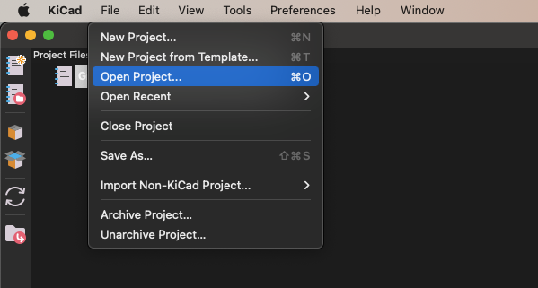

2. Find the "Grove Vision AI V2 Library" and open the project:

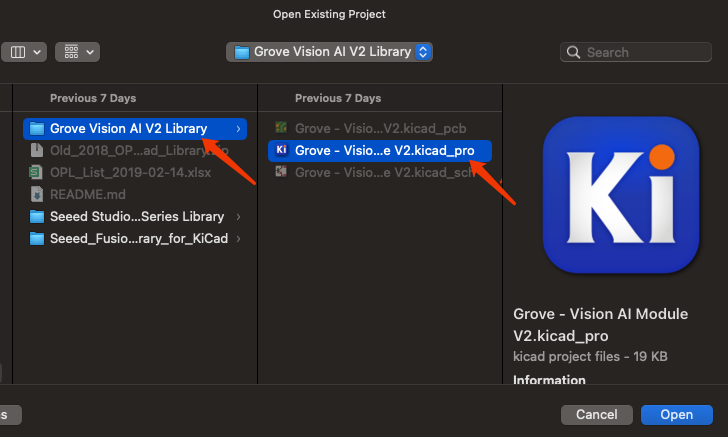

3. Double click the "Grove Vision AI V2" PCB file and you will see below:

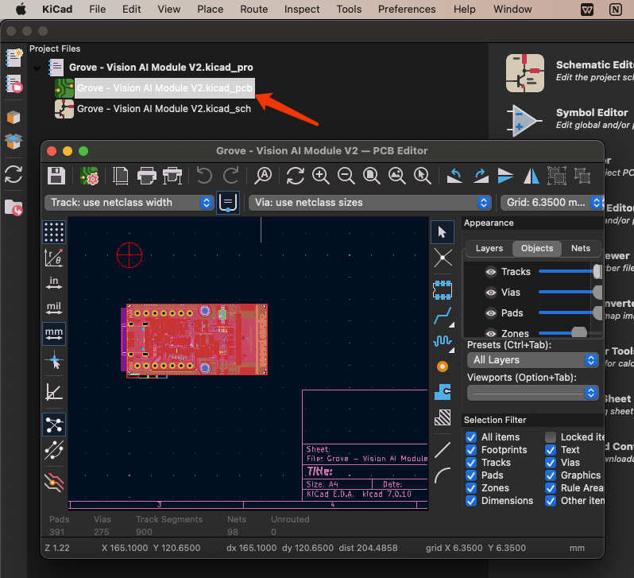

4. Refer to the `Preferences -> Manage Footprint Libraries`

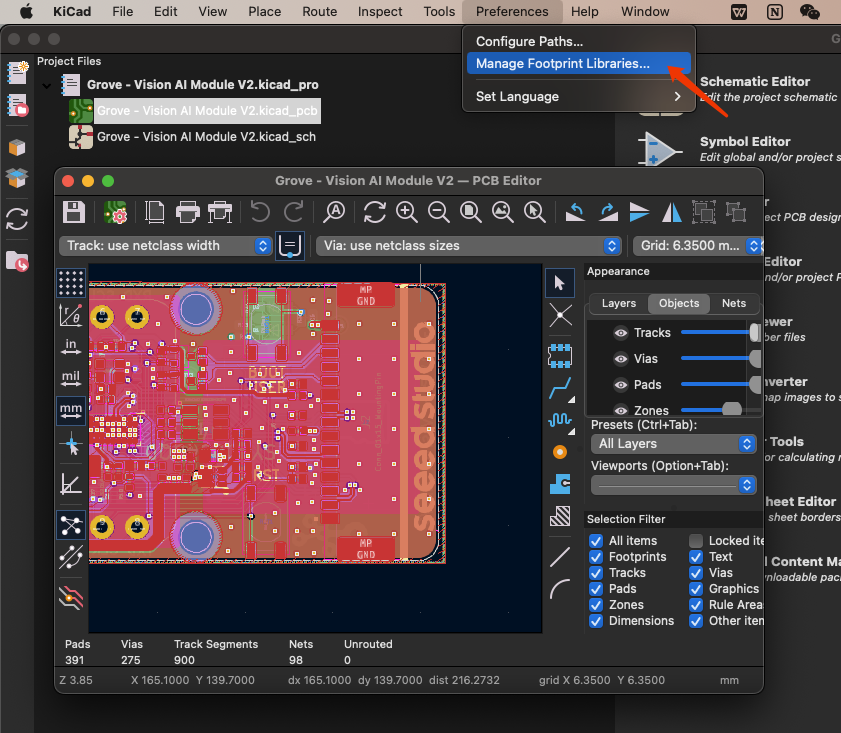

5. Here is the existed footprint libraries and you can click the button below:

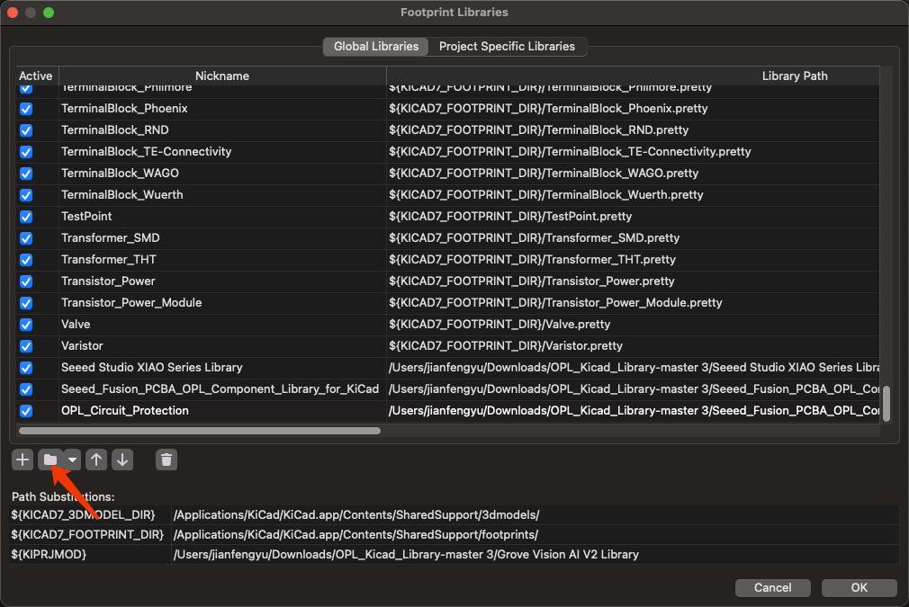

6. Find the "Grove Vision AI V2 Library" and open the folder that contains the boards footprint:

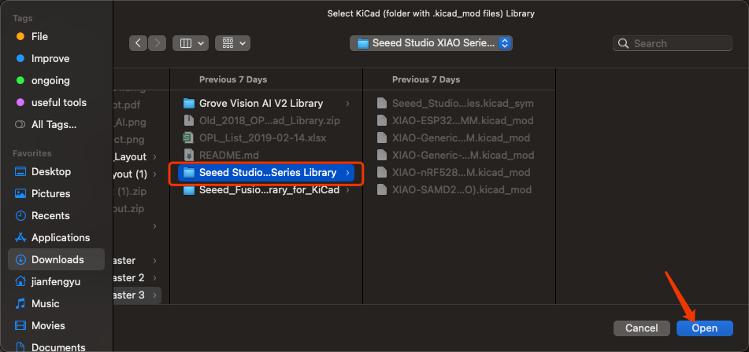

Now you have added the "XIAO footprint library"

7. You can click here to use the added library:

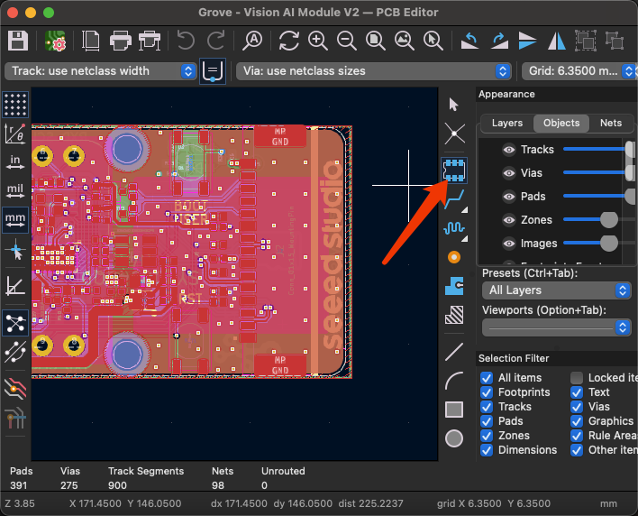

8. Search for "seeed" and you can check the footprint added:

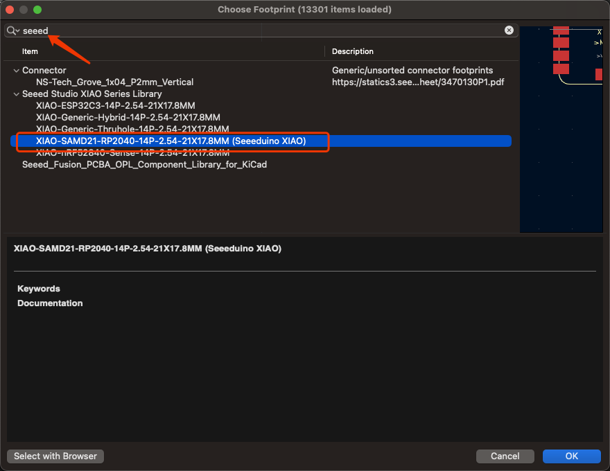

9. Click "ok" and you can add the XIAO RP2040 footprint into the "Grove Vision VI V2".

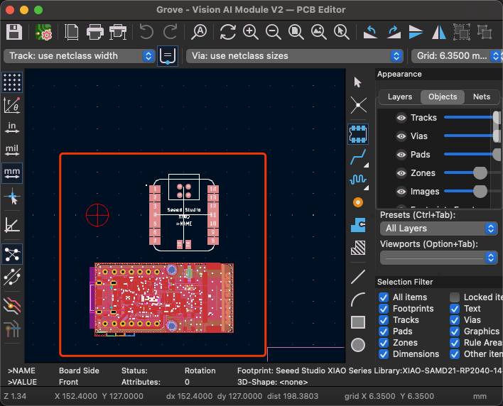

10. You can change any component on the Grove Vision VI V2 module and make it your own project.

## <span id="jump3"> How to add and use Seeed OPL Symbol Libraries </span>

### Take Grove Vision AI V2 and Sensor-Transducer as an Example:

1. Open KiCad and refer to `File -> Open Project`.


2. Find the "Grove Vision AI V2 Library" and open the project:


3. Double click the "Grove Vision AI V2" .sch file and you will see below:

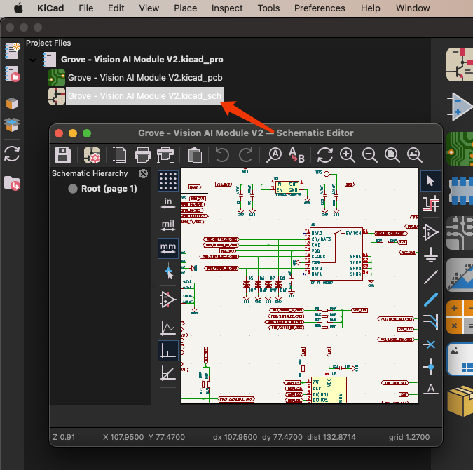

4. Refer to the `Preferences -> Manage Symbol Libraries`

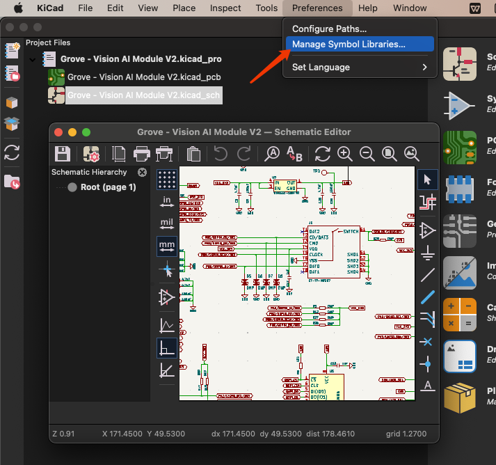

5. Here is the existed symbol libraries and you can click the button below:

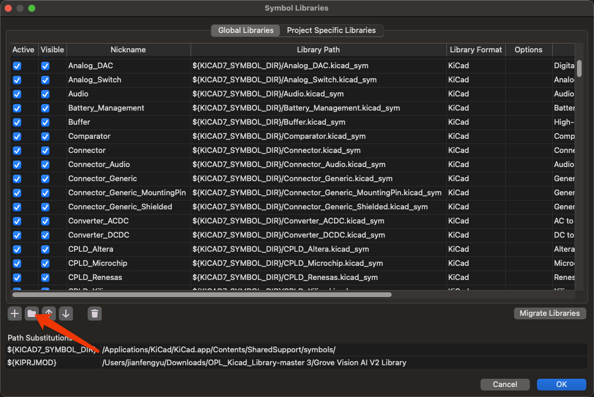

6. Find the "OPL_Sensor-Transducer" lib file:

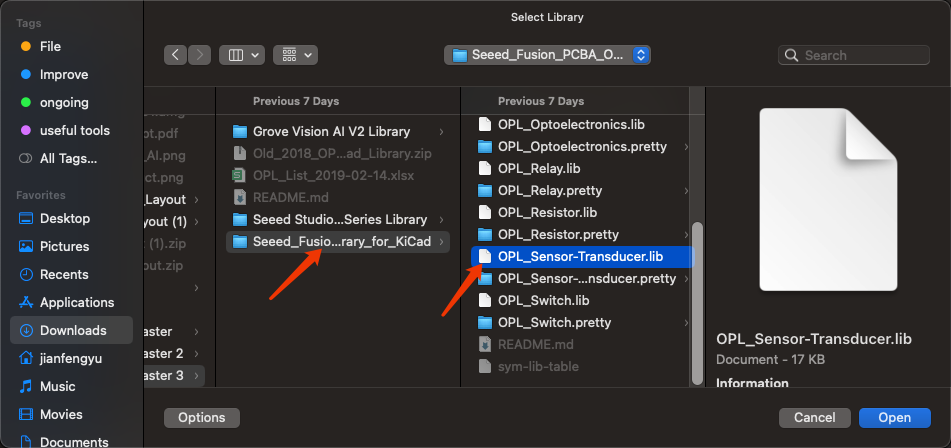

Now you have added the "OPL_Sensor-Transducer library"

7. You can click here to use the added library:

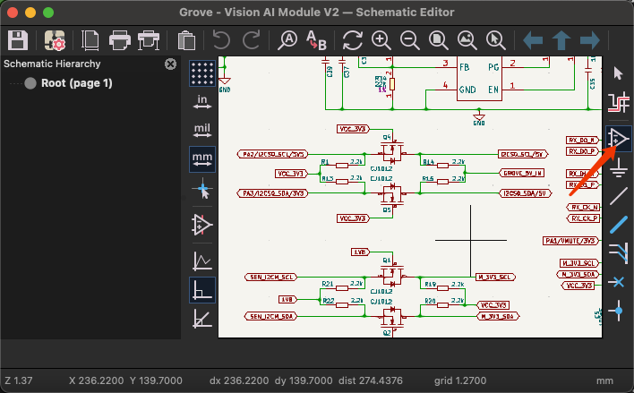

8. Search for "OPL" and you can check the symbol added:

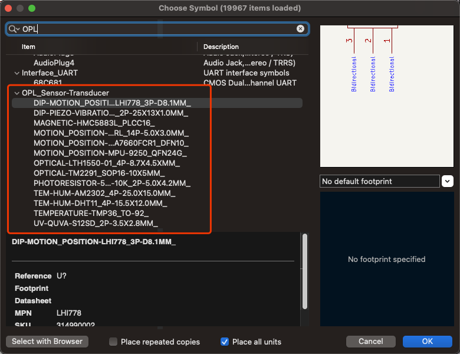

9. Click "ok" and you can add it into the "Grove Vision VI V2".


10. You can change any component on the Grove Vision VI V2 module and make it your own project.

## <span id="jump4"> Scale up Your Creation With Seeed Studio Fusion </span>

Seeed Studio Fusion serves as the comprehensive service platform for Seeed Studio, a global one-stop online platform offering PCB manufacturing, PCB assembly and hardware customization with global sourcing capability. Whether you need prototyping, mass production, custom solutions for open-source products, or the transformation of your creative ideas into profitable products, Seeed Studio Fusion can meet your requirements.

- [PCB/PCBA Design](https://www.seeedstudio.com/fusion_pcb.html)
- [Fusion Website](https://www.seeedstudio.com/fusion.html)
- **Email Contact**: fusion@seeed.io


## <span id="jump5"> Co-Create with Seeed Studio </span>

Leverage our Co-Create Program to transform your advanced prototype into a commercially successful product! This program is designed to optimize your product's journey from prototype to market by handling marketing, packaging, and distribution, allowing you to concentrate on refining your product. Upon acceptance of your prototype by Seeed, it will be showcased on the Seeed Studio marketplace. You'll receive a portion of the profits for each unit sold.

- [Application Form](https://docs.google.com/forms/d/e/1FAIpQLSe3A7_rIbn2OLO4JyJd_poGZodItCaRy6M6-3FtdqL3xG1Usg/viewform)
- [Co-Create Website](https://www.seeedstudio.com/co-create.html)


## <span id="jump6"> Resources </span>

- [Seeed Studio Open Parts List](https://files.seeedstudio.com/wiki/OPL/OPL_list.xlsx)

<!-- ## Even More Components!


As of last December, the [OPL has expanded](http://www.seeedstudio.com/blog/2018/12/04/just-what-you-wanted-for-xmas-introducing-the-new-shenzhen-open-parts-library-with-over-10000-parts/) from 800 components to more than 10,000 with the introduction of the new Shenzhen OPL. The original Seeed OPL is a catalog of components from Seeed’s own inventory, we have the parts and, we have been using them in our own production processes for years. The Shenzhen OPL contains parts from Shenzhen’s biggest components distributor that Seeed can quickly order for turnkey PCBA. While the sources are different, both can be used together with the Seeed Fusion PCBA service and reduce the production time to 7 days.

But with all the new components and many more to come, we don’t have enough resources to create the footprints for all of them. So, we are asking for help from you and the wider community to gradually build-up the library with us. As more and more users utilize the OPL and update the component libraries, the better the library will become for everyone. 

To assist with the process, we have designated a team of engineers to maintain the library and GitHub repositories. They will also help draw some footprints and connect schematic symbols. But while our engineers do their best to check each footprint, with the sheer number of components, it is inevitable that some errors will be present. It is unavoidable. So to make up for it, Seeed Fusion has introduced a re-manufacture promise: If an error in the library requires the boards to be re-manufactured, then we will re-manufacture the corrected boards for you for free. By using this library, you accept this potential risk.

## Footprint Design Guidelines
It is still early days, and we have a lot of catching up to do. So, the most important additions at this stage are unique symbols and footprints and any generic footprints that are missing. Part-specific symbols that use generic footprints and slight variations of generic footprints can be added later.

For consistency and ease of use, we would greatly appreciate it if everyone followed the same guidelines for new additions to the library:

-	The previous component libraries have been re-organized to match the Shenzhen OPL’s categorization. Please add new entries to the relevant sub-library according to the online OPL library’s classification.
-	Please take the time to study [KiCad’s own Library Convention](http://kicad-pcb.org/libraries/klc/) and ensure that the new footprints comply. Please refer to other footprints in the OPL or KiCad’s built-in footprints for reference. 
-	For MPN specific footprints, please follow the existing footprint naming convention for the footprint and name the corresponding schematic symbol with the manufacturer part number.

### Notes:
- #### The current version of the KiCad Library has been completely revamped in response to all the feedback we have recieved. Originally a direct import of the Eagle library, the old library did not comply with KiCad guidelines and placed features on the wrong layers. For the latest version, we have throroughly investigated the issues and revised (nearly) all of the footprints. Let us know if you think we missed something!

-	The Seeed OPL component libraries have been updated to match the Shenzhen OPL categories to aid in merging the two libraries. Some components will have moved to new homes, but this has not been updated on the website OPL library yet. We will update this soon!
-	Some of the original Seeed OPL KiCad component footprints have not been updated to match KiCad’s design guidelines yet. They are safe to use, and the pads are correct, but they may look a little ugly.
-	Unlike previous versions, we have uploaded the files individually as opposed to a whole zip file. We hope this will help you follow standard GitHub workflow to contribute changes. (Thanks for your feedback!)

There is a lot to consider in managing a large library like this, so we would greatly appreciate any ideas and feedback regarding how we can make the library more user-friendly. We’ll be monitoring the discussion section and the designated OPL section in our forums. You are also welcome to let us know by [e-mail](mailto:fusion@seeed.cc).

We hope the new maintained library will prove to be an invaluable resource to all of our PCBA users and beyond.

## Resources
1. A KiCad Bill-of-Materials (BOM) plugin to follow SeeedStudio's Fusion PCBA assembly service's template, This plugin is set up to use the KiCad schematic's part data as it is provided in Seeed Studio's Open Parts Library (OPL) collection for KiCad. - https://github.com/imrehg/kicad-bom-seeedstudio


[](https://github.com/igrigorik/ga-beacon) -->
